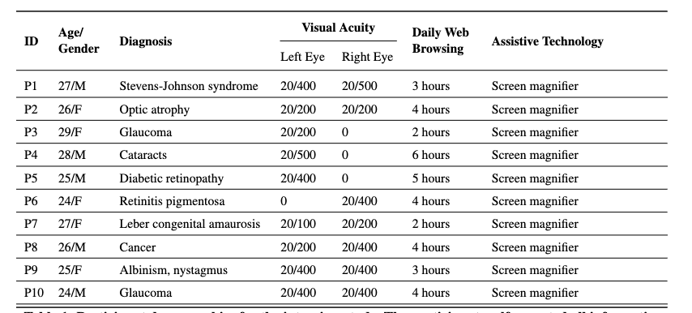

# Improving Usability of Data Charts in Multimodal Documents for Low Vision Users

##

## 1. Participants
We recruited 10 low-vision smartphone users (5 females and 5 males) through email lists and word-of-mouth referrals. The participants had an average age of 26.1 years (Median = 26, Minimum = 24, Maximum = 29). Our inclusion criteria mandated that all participants be users of screen magnifiers. Individuals with extremely low visual acuity who are unable to use screen magnifiers were excluded from the study. Each participant had experience with at least one type of screen magnifier, such as ZoomText, Android Magnification accessibility service (\url{https://support.google.com/accessibility/android/answer/6006949}), or Apple Zoom (\url{https://support.apple.com/en-in/guide/machelp/mh40579/mac}). They reported frequent interactions with online charts for professional, educational, or personal purposes.

