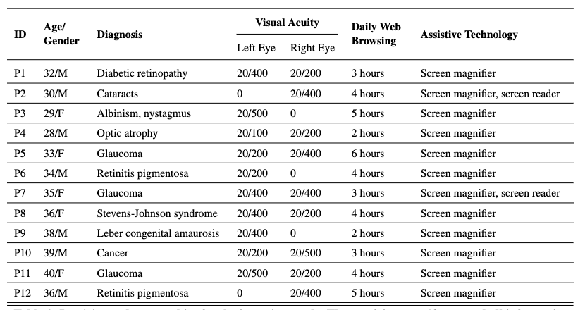

# Improving Usability of Data Charts in Multimodal Documents for Low Vision Users

## 1. Apparatus
For the study, we developed an all-in-one Android application that supported all the experimental conditions. This application was installed on a Samsung Galaxy S23 Ultra smartphone featuring a 6.8-inch display, catering to participants' preference for large-screen devices. The smartphone's screen was configured to a resolution of 3088 x 1440 pixels and a refresh rate of 120 Hz. Additionally, the visual elements in the app, such as the bars in the charts, were rendered in a default shade of green against a white background, and the text was displayed using Times New Roman font at a size of 14px. Each bar in the charts had a width of 0.6 cm. The app enabled the experimenter to assign charts to specific conditions and to set the sequence of these conditions before initiating the study with a participant. To further enhance usability, especially for participants accustomed to iOS devices, we integrated iOS-style panning and zooming functionalities into the app’s configuration settings, ensuring that iPhone users could effectively perform the tasks on our Android platform.

## 2. Procedure

The experimenter initially obtained formal consent from the participants before briefly outlining the study's objectives. Participants were then introduced to the mobile app, where they received a comprehensive overview of its various features and customization options. This introduction was followed by a 15-minute practice session, during which participants familiarized themselves with the user interface and adjusted the available settings to their preferences. Subsequently, participants executed the study tasks in a predetermined sequence. After completing each task—and thereby each condition—the experimenter administered the usability and perceived effort questionnaire to assess the participant's perceived usability and interaction workload for that specific condition. The study concluded with a brief exit interview, where participants provided subjective feedback. With the participants’ consent, the entire session was recorded. The experimenter also noted any peculiar interaction behaviors observed during the session. Participants were compensated with an Amazon gift card, and all interactions were conducted in English.

## Table : Participant demographics for the interview study. The participants self-reported all information.

